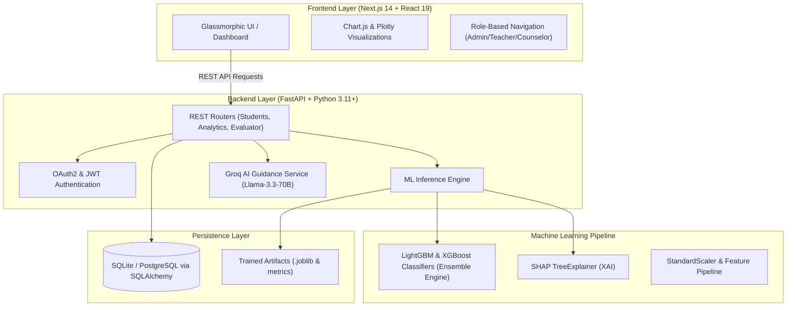

# 🎓 DropGuard — Early-Warning AI System for Student Dropout Prevention

<p align="center">
  <a href="https://dropguard-app.onrender.com"></a>
  <a href="https://dropguard-backend.onrender.com/docs"></a>
  <a href="https://github.com/novatrix-2030/SIH-2026"></a>
</p>

<p align="center">
  
  
  
  
  
  
</p>

<p align="center">
  <b>DropGuard</b> is an explainable, multi-factor AI-driven early warning platform engineered to predict, analyze, and proactively prevent student dropouts in Indian secondary and higher education institutions.
</p>

> ### 🌐 Quick Links to Launch & Open DropGuard
> | Service | Platform | Link | Description |
> | :--- | :--- | :--- | :--- |
> | 🚀 **Live Web Portal** | **Render Cloud** | **[Open DropGuard Web App](https://dropguard-app.onrender.com)** | Production Next.js dashboard on Render |
> | ⚡ **Live API Docs** | **Render Cloud** | **[Open Swagger UI](https://dropguard-backend.onrender.com/docs)** | Interactive FastAPI Swagger documentation |
> | 💻 **Local Portal (Presentation)** | **Localhost** | **[http://localhost:3000](http://localhost:3000)** | Next.js local development portal |
> | 📂 **GitHub Repository** | **GitHub** | **[github.com/novatrix-2030/SIH-2026](https://github.com/novatrix-2030/SIH-2026)** | Source code, models, and documentation |

---

## 📌 Table of Contents

- [Live Website & Quick Links](#-quick-links-to-launch--open-dropguard)
- [Executive Summary](#-executive-summary)
- [Problem Statement & The Challenge](#-problem-statement--the-challenge)
- [Core Innovation & Key Features](#-core-innovation--key-features)
- [System Architecture](#-system-architecture)
- [Machine Learning & Explainable AI (XAI)](#-machine-learning--explainable-ai-xai)
- [Tech Stack](#-tech-stack)
- [Quick Start (Local Presentation Guide)](#-quick-start-local-presentation-guide)
- [Demo Credentials for Jury](#-demo-credentials-for-jury)
- [Interactive API Documentation](#-interactive-api-documentation)
- [Alignment with NEP 2020](#-alignment-with-nep-2020)
- [Global Deployment Architecture](#-global-deployment-architecture)
- [Team & Acknowledgments](#-team--acknowledgments)

---

## 💡 Executive Summary

According to national educational surveys, millions of students drop out before completing their secondary or higher secondary education due to a compounding matrix of **academic distress, financial hardship, attendance deterioration, and psychological burnout**. Most institutional responses are reactive — occurring *after* the student has already discontinued their education.

**DropGuard transforms dropout prevention from reactive damage control to proactive, explainable intervention:**
- 🔍 **Predicts** dropout risk months in advance using multi-factor gradient-boosted trees.
- 🧩 **Explains** the root causes for every prediction using **SHAP (Shapley Additive exPlanations)** waterfall charts, breaking the "black-box" barrier for teachers and counselors.
- 🎯 **Prescribes** personalized interventions (peer tutoring, fee waivers, counseling sessions).
- 🧭 **Evaluates** Class 12 Drop-Year risks with integrated **Groq AI (Llama-3.3-70B)** guidance for students attempting competitive exams (JEE/NEET).

---

## 🎯 Problem Statement & The Challenge

- **PS Code:** `SIH-2026-13-002`
- **Category:** Smart Education
- **Theme:** AI & Machine Learning for Student Retention & Well-Being

| Traditional Institution Workflow | DropGuard Intelligent Workflow |
| :--- | :--- |
| ❌ Attendance and grade data stored in silos | ✅ Unified multi-factor real-time data ingestion |
| ❌ Dropout detected only after weeks of absence | ✅ Early risk scoring updated continuously |
| ❌ Generic, one-size-fits-all counselor talks | ✅ Personalized, AI-prescribed intervention plans |
| ❌ "Black-box" predictive models educators cannot trust | ✅ Transparent, feature-by-feature SHAP explainability |

---

## 🚀 Core Innovation & Key Features

### 1. 🔍 Multi-Factor Risk Assessment
Evaluates students across four distinct risk pillars:
- **Academic Performance:** Subject mark trends, failure velocity, assignment turnaround.
- **Attendance Patterns:** Consecutive unexcused absences, day-of-week dropouts, proxy patterns.
- **Socio-Economic Factors:** Distance from school, household income bracket, scholarship status.
- **Behavioral & Well-being Indicators:** Extracurricular engagement, historical drop-year pressures.

### 2. 🧩 Explainable AI (SHAP Waterfall Analysis)
No guessing. For every at-risk student, DropGuard displays interactive SHAP waterfall plots detailing exactly which features pushed the risk score up (e.g., *+28% due to Mathematics score decline*, *+19% due to 68% attendance*) or down (*-14% due to high peer collaboration*).

### 3. 🛡️ Prescriptive Intervention Engine
Categorizes recommended actions by urgency:
- **Urgent:** Immediate parental notification, financial hardship scholarship referral.
- **Moderate:** Assigned 1-on-1 peer mentor, study schedule restructuring.
- **Preventative:** Attendance threshold alerts sent directly to educators.

### 4. 🎓 Class 12 Drop-Year Evaluator (Powered by Groq AI)
A dedicated assessment engine for competitive exam aspirers (JEE, NEET, etc.) calculating the probability of drop-year success, burnout index, and tailored advice generated by **Groq AI (Llama 3.3-70B)** with zero-downtime offline fallback.

### 5. 📈 Temporal Risk Tracking & Cohort Analytics
Visualizes risk progression over a 6-month timeline via interactive Plotly & Chart.js dashboards, enabling principals and department heads to uncover systemic curriculum or batch-level hurdles.

### 6. 🔒 Role-Based Access Control (RBAC)
Tailored UI experiences for **Administrators**, **Department Teachers**, and **Counselors** respecting student data privacy and institutional governance.

---

## 🏗️ System Architecture



---

## 🔬 Machine Learning & Explainable AI (XAI)

The DropGuard predictive engine uses an optimized **LightGBM & XGBoost Ensemble** cross-validated across heterogeneous student cohorts:

| Metric | Score | Significance |
| :--- | :--- | :--- |
| **Accuracy** | **93.67%** | High overall fidelity across risk classes |
| **Precision** | **94.56%** | Minimal false alarms; prevents alarm fatigue for educators |
| **Recall** | **92.67%** | Successfully flags >92 out of 100 vulnerable students |
| **F1-Score** | **93.60%** | Optimal harmonic balance of precision and recall |
| **ROC-AUC** | **0.9888** | Superior discriminatory separation across risk tiers |
| **5-Fold CV AUC** | **0.9904** | Consistent generalization without overfitting |

---

## 💻 Tech Stack

### Frontend
- **Framework:** Next.js 14 (App Router) & React 19
- **Styling:** Vanilla Glassmorphism CSS with CSS Custom Properties & dynamic dark/light theme
- **Visualizations:** Chart.js, React-Chartjs-2, Plotly.js (`react-plotly.js`)
- **Animations:** CSS Keyframes & IntersectionObserver scroll reveals

### Backend & AI
- **API Framework:** FastAPI (Asynchronous Python REST API)
- **Machine Learning:** LightGBM, XGBoost, Scikit-Learn, Joblib, NumPy, Pandas
- **Explainability:** SHAP (`shap.TreeExplainer`)
- **LLM Guidance:** Groq AI Cloud API (`llama-3.3-70b-versatile`)
- **Database & ORM:** SQLite (development/presentation) / PostgreSQL (production) via SQLAlchemy
- **Security:** OAuth2 password bearer flow with JWT (jose) and PBKDF2/Bcrypt password hashing

---

## ⚡ Quick Start (Local Presentation Guide)

> [!TIP]
> **For College Presentation & Jury Evaluation:** Use the automated one-click launcher!

### Option A: 1-Click Presentation Launcher (Recommended)
1. Double-click **`run_local.bat`** in the project root folder.
2. The script will automatically:
   - Start the FastAPI Backend on `http://127.0.0.1:8000`
   - Start the Next.js Frontend on `http://localhost:3000`
   - Open your default browser directly to the DropGuard portal!

---

### Option B: Manual Terminal Execution

#### 1. Backend Server
```bash
cd backend
pip install -r requirements.txt
python -m uvicorn main:app --reload --port 8000
```
*Backend runs at: [http://127.0.0.1:8000](http://127.0.0.1:8000)*

#### 2. Frontend Application
```bash
cd frontend
npm install
npm run dev
```
*Frontend dashboard opens at: [http://localhost:3000](http://localhost:3000)*

---

## 🔑 Demo Credentials for Jury

| Role | Username | Password | Purpose / Scope |
| :--- | :--- | :--- | :--- |
| **Admin** *(Recommended)* | `admin` | `admin123` | Institutional dashboard, school-wide risk stats, all students |
| **Teacher** | `teacher` | `teacher123` | Class and department-level trends & attendance tracking |
| **Counselor** | `counselor` | `counselor123` | Individual student deep-dives, SHAP plots, intervention logs |

---

## 📖 Interactive API Documentation

FastAPI provides an automatic, interactive Swagger UI documentation dashboard. During your presentation, you can demonstrate the live API endpoints at:

🔗 **Swagger UI:** [http://127.0.0.1:8000/docs](http://127.0.0.1:8000/docs)  
🔗 **ReDoc Alternative:** [http://127.0.0.1:8000/redoc](http://127.0.0.1:8000/redoc)

Key endpoints available:
- `POST /api/auth/login` — JWT Authentication token issuance
- `GET /api/analytics/dashboard` — High-level institutional metrics & risk breakdown
- `GET /api/students/{id}/risk` — Detailed SHAP feature-importance breakdown
- `POST /api/evaluator/evaluate` — Class 12 Drop-Year evaluation with Groq AI analysis

---

## 🇮🇳 Alignment with NEP 2020

DropGuard directly advances core directives outlined in the **National Education Policy (NEP 2020)**:
1. **Section 3.1 — Ensuring Universal Access to Education:** Early warning mechanisms to prevent children from falling out of the educational mainstream.
2. **Section 3.6 — Tracking Students & Their Learning Levels:** Real-time temporal performance and attendance monitoring.
3. **Section 4.34 — Socio-Emotional Well-Being:** Proactive identification of academic burnout and peer counseling support.

---

## 🌐 Global Deployment Architecture

DropGuard is configured for automated full-stack cloud deployment on **Render** using the root [`render.yaml`](render.yaml) Infrastructure-as-Code blueprint:

| Service Component | Framework / Runtime | Render Service Type | Live Production URL |
| :--- | :--- | :--- | :--- |
| **Frontend Portal** | Next.js 16 / React 19 | Web Service (`dropguard-frontend`) | [https://dropguard-app.onrender.com](https://dropguard-app.onrender.com) |
| **Backend API Engine** | FastAPI / Python 3.11 | Web Service (`dropguard-backend`) | [https://dropguard-backend.onrender.com](https://dropguard-backend.onrender.com) |
| **Interactive API Docs** | OpenAPI / Swagger UI | Web Service Endpoint | [https://dropguard-backend.onrender.com/docs](https://dropguard-backend.onrender.com/docs) |
| **ML & XAI Engine** | LightGBM + XGBoost + SHAP | In-Memory Async Worker | Integrated in Backend Service |

### Deploying via Render Blueprint:
1. Connect the GitHub repository **`novatrix-2030/SIH-2026`** in your [Render Dashboard](https://dashboard.render.com).
2. Click **New +** → **Blueprint** and select `render.yaml`.
3. Render automatically provisions, builds, and deploys both the frontend and backend with continuous integration on every `git push`.

---

## 👥 Team & Acknowledgments

- **Team Name:** Novatrix
- **Event:** Smart India Hackathon (SIH 2026)
- **Repository:** [https://github.com/novatrix-2030/SIH-2026](https://github.com/novatrix-2030/SIH-2026)

<p align="center">
  <sub>Built with ❤️ by Team Novatrix for SIH 2026 — Empowering educators to ensure no student is left behind.</sub>
</p>
